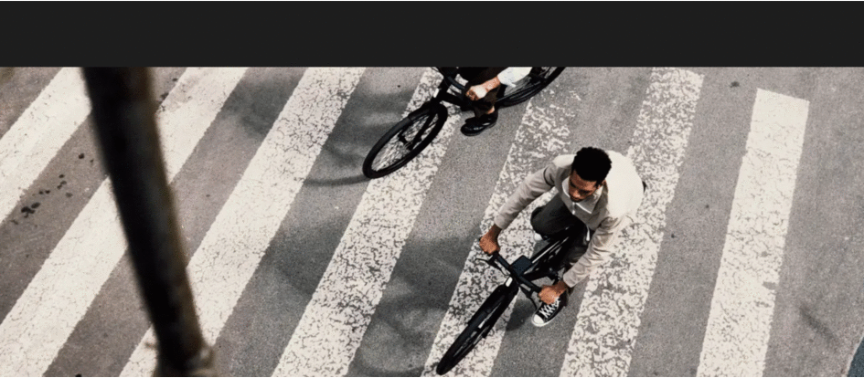

# 📊 Landing page for bikes store

[Click here to see DEMO LINK](https://sholudyvyy.github.io/mybike-landing-page/)

## 🚀 Project Overview

- Fully Responsive Design - Works perfectly on desktops, tablets, and mobile devices.

- Smooth Animations - Enhances engagement with dynamic UI elements.

- Interactive Elements - Hover effects and dynamic scrolling.

- Detailed Product Showcase - Displays high-quality images, specifications, and pricing.

- Modern UI/UX - Minimalistic dark-themed design with elegant typography.

- Contact Form - Easy way for users to get in touch.

- Optimized Performance - Fast loading and asset optimization.


### Screenshot



## 🛠 Tech Stack

- **HTML**
- **CSS**
- **Flexbox & Grid**
- **SASS**
- **VITE**

## 🔧 Installation

### Prerequisites
- Node.js v22.11.0
- npm v10.9.0

### Setup

1. Clone the repository
```bash
git clone https://github.com/Sholudyvyy/mybike-landing-page.git
cd mybike-landing-page
```
2. Start project
```bash
npm install
npm run dev
```
****
